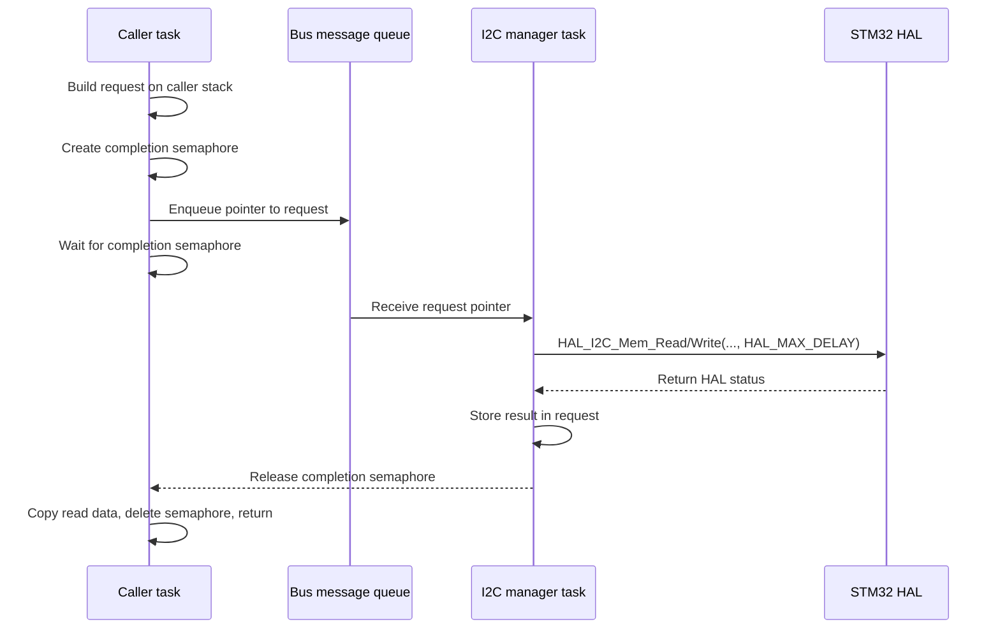

# I2C Manager Module

## Overview

The I2C Manager module serializes STM32 HAL memory-read and memory-write operations through dedicated CMSIS-RTOS2 worker tasks. It exposes synchronous, task-level APIs while using a message queue and a per-request semaphore internally.

The module supports three physical I2C buses:

| Bus identifier | HAL handle | RTOS queue | Manager task entry point |
|---|---|---|---|
| `I2C_BUS_1` | `hi2c1` | `i2c1QueueHandle` | `I2C1_ManagerTask()` |
| `I2C_BUS_2` | `hi2c2` | `i2c2QueueHandle` | `I2C2_ManagerTask()` |
| `I2C_BUS_3` | `hi2c3` | `i2c3QueueHandle` | `I2C3_ManagerTask()` |

Each bus has its own queue and manager task. Requests on the same bus are executed sequentially; requests on different buses may execute concurrently.

## Files

| File | Purpose |
|---|---|
| `i2c_manager.h` | Public types, configuration, synchronous API declarations, and task entry points. |
| `i2c_manager.c` | Queue submission, request completion handling, HAL dispatch, and manager task implementations. |

## Dependencies

The module depends on:

- STM32 HAL I2C support, including `I2C_HandleTypeDef`, `HAL_I2C_Mem_Read()`, and `HAL_I2C_Mem_Write()`.
- CMSIS-RTOS2 message queues, semaphores, and task-delay functions.
- FreeRTOS through `pdMS_TO_TICKS()`.
- CubeMX-generated I2C handles and RTOS queue handles.

The following symbols must exist and be link-visible:

```c
extern I2C_HandleTypeDef hi2c1;
extern I2C_HandleTypeDef hi2c2;
extern I2C_HandleTypeDef hi2c3;

extern osMessageQueueId_t i2c1QueueHandle;
extern osMessageQueueId_t i2c2QueueHandle;
extern osMessageQueueId_t i2c3QueueHandle;
```

The current implementation references all three handles and queues. Projects using fewer than three buses must either define all symbols or remove the unused bus cases and task entry points.

## Architecture

A caller creates a request descriptor on its stack, creates a binary semaphore, and places a **pointer** to the request into the selected bus queue. The corresponding manager task receives that pointer, performs the blocking HAL transfer, stores the result, and releases the semaphore. The caller then resumes and returns the HAL status.



### Serialization model

- All operations submitted to one bus use one worker task and therefore execute one at a time.
- The three buses are independent and may operate in parallel.
- Queue priority is always `0`; requests are normally processed in queue order.
- Code outside this module must not call HAL I2C functions on the managed handles concurrently. Doing so bypasses serialization and can corrupt HAL state.

## Configuration

### Maximum transfer size

```c
#define I2C_MGR_MAX_DATA_LEN 4U
```

A single read or write may transfer at most `I2C_MGR_MAX_DATA_LEN` bytes. The request contains an inline data buffer of this size.

Increasing the value:

- permits larger transfers;
- increases the size of every `I2C_Request_t`;
- increases caller stack usage because each public API function allocates one request locally.

### Queue item size

Each message queue must store an `I2C_Request_t *`, not an `I2C_Request_t` value.

```c
osMessageQueueNew(queue_length, sizeof(I2C_Request_t *), &queue_attributes);
```

This requirement is critical. Both `osMessageQueuePut()` and `osMessageQueueGet()` operate on a pointer variable. Configuring the queue with `sizeof(I2C_Request_t)` can cause out-of-bounds reads and writes in the RTOS queue API.

### Queue length

Queue length controls how many callers may wait to submit operations while the manager task is busy. Select a length based on the maximum number of tasks that may submit to the same bus concurrently.

### Manager tasks

Create one task for each enabled bus and assign the matching entry point:

```c
I2C1_ManagerTask
I2C2_ManagerTask
I2C3_ManagerTask
```

The task argument is ignored. Each task runs permanently and blocks on its queue when idle.

The task priority must allow the manager to run whenever callers are blocked waiting for completion. Its stack must be sufficient for the HAL call chain and RTOS operations.

## Public types

### `I2C_BusId_t`

Selects the physical I2C peripheral.

```c
typedef enum {
    I2C_BUS_1 = 0,
    I2C_BUS_2,
    I2C_BUS_3,
    I2C_BUS_COUNT
} I2C_BusId_t;
```

`I2C_BUS_COUNT` is a sentinel and is not a valid bus argument.

### `I2C_OpType_t`

Identifies the operation executed by the manager task.

```c
typedef enum {
    I2C_OP_WRITE = 0,
    I2C_OP_READ
} I2C_OpType_t;
```

### `I2C_Request_t`

Internal request descriptor passed between a caller and a manager task.

| Field           | Description                                                             |
| --------------- | ----------------------------------------------------------------------- |
| `op`            | Read or write operation type.                                           |
| `dev_addr`      | HAL-formatted device address. For a 7-bit address, pass `address << 1`. |
| `mem_addr`      | Device register or memory address.                                      |
| `mem_addr_size` | `I2C_MEMADD_SIZE_8BIT` or `I2C_MEMADD_SIZE_16BIT`.                      |
| `size`          | Number of bytes to transfer.                                            |
| `data`          | Inline transfer buffer with `I2C_MGR_MAX_DATA_LEN` bytes.               |
| `result`        | HAL result written by the manager task.                                 |
| `done_sem`      | Per-request semaphore used to wake the caller.                          |

Application code normally does not construct this type directly.

## Device address format

`DevAddress` must use the address format expected by the STM32 HAL. For a normal 7-bit I2C address, shift the address left by one bit before passing it to the manager.

```c
#define SENSOR_ADDRESS_7BIT 0x68U
#define SENSOR_ADDRESS_HAL  (SENSOR_ADDRESS_7BIT << 1)
```

For example, the 7-bit address `0x68` is passed to the API as `0xD0`.

## API reference

### `I2C_Mem_Write`

Writes data to a device register or memory location.

```c
HAL_StatusTypeDef I2C_Mem_Write(
    I2C_BusId_t bus,
    uint16_t DevAddress,
    uint16_t MemAddress,
    uint16_t MemAddSize,
    uint8_t *pData,
    uint16_t Size,
    uint32_t timeout_ms
);
```

#### Parameters

| Parameter | Description |
|---|---|
| `bus` | Target physical bus. Must be `I2C_BUS_1`, `I2C_BUS_2`, or `I2C_BUS_3`. |
| `DevAddress` | HAL-formatted device address; a 7-bit address must be shifted left by one. |
| `MemAddress` | Register or memory address inside the target device. |
| `MemAddSize` | Address width: `I2C_MEMADD_SIZE_8BIT` or `I2C_MEMADD_SIZE_16BIT`. |
| `pData` | Pointer to the bytes to write. Must not be `NULL`. |
| `Size` | Number of bytes to write; must not exceed `I2C_MGR_MAX_DATA_LEN`. |
| `timeout_ms` | Wait limit used for queue insertion and, separately, for request completion. |

The function copies `Size` bytes from `pData` into the request before submitting it.

#### Return values

| Return value | Meaning |
|---|---|
| `HAL_OK` | Transfer completed successfully. |
| `HAL_ERROR` | Invalid input, invalid bus, missing queue, semaphore creation failure, or a HAL transfer error. |
| `HAL_TIMEOUT` | Queue insertion or completion wait timed out, or the HAL operation returned `HAL_TIMEOUT`. |
| `HAL_BUSY` | The HAL operation returned `HAL_BUSY`. |

### `I2C_Mem_Read`

Reads data from a device register or memory location.

```c
HAL_StatusTypeDef I2C_Mem_Read(
    I2C_BusId_t bus,
    uint16_t DevAddress,
    uint16_t MemAddress,
    uint16_t MemAddSize,
    uint8_t *pData,
    uint16_t Size,
    uint32_t timeout_ms
);
```

#### Parameters

The parameters have the same meaning as for `I2C_Mem_Write()`. `pData` is the destination buffer.

The manager task reads into the request's inline buffer. The API copies data into `pData` only when the operation returns `HAL_OK`. On failure, the contents of `pData` are unchanged by this function.

#### Return values

The return values are the same as for `I2C_Mem_Write()`.

### Manager task entry points

```c
void I2C1_ManagerTask(void *argument);
void I2C2_ManagerTask(void *argument);
void I2C3_ManagerTask(void *argument);
```

These functions are RTOS task entry points. They do not return and should not be called as normal functions.

## Timeout behavior

`timeout_ms` does not directly become the timeout passed to the STM32 HAL operation.

The current implementation uses it twice:

1. as the maximum wait for space in the message queue;
2. as a new maximum wait for the manager task to release the completion semaphore.

Consequences:

- Total caller blocking time may approach twice `timeout_ms`, plus scheduler overhead.
- The HAL transfer itself uses `HAL_MAX_DELAY` and may continue after the caller's completion wait expires.
- `timeout_ms == 0` is unsafe once a request has been queued because the caller can immediately abandon a request that the manager task still owns.

The API therefore does not currently implement one end-to-end deadline.

## Usage examples

### Write one 8-bit register

```c
#include "i2c_manager.h"

#define SENSOR_ADDRESS_HAL (0x68U << 1)

HAL_StatusTypeDef sensor_enable(void)
{
    uint8_t value = 0x01U;

    return I2C_Mem_Write(
        I2C_BUS_1,
        SENSOR_ADDRESS_HAL,
        0x10U,
        I2C_MEMADD_SIZE_8BIT,
        &value,
        1U,
        100U
    );
}
```

### Read two bytes

```c
#include "i2c_manager.h"

#define SENSOR_ADDRESS_HAL (0x68U << 1)

HAL_StatusTypeDef sensor_read_value(uint16_t *value)
{
    uint8_t data[2];

    if (value == NULL) {
        return HAL_ERROR;
    }

    HAL_StatusTypeDef status = I2C_Mem_Read(
        I2C_BUS_1,
        SENSOR_ADDRESS_HAL,
        0x20U,
        I2C_MEMADD_SIZE_8BIT,
        data,
        sizeof(data),
        100U
    );

    if (status == HAL_OK) {
        *value = ((uint16_t)data[0] << 8) | data[1];
    }

    return status;
}
```

### Use a 16-bit memory address

```c
uint8_t buffer[4];

HAL_StatusTypeDef status = I2C_Mem_Read(
    I2C_BUS_2,
    EEPROM_ADDRESS_7BIT << 1,
    0x0120U,
    I2C_MEMADD_SIZE_16BIT,
    buffer,
    sizeof(buffer),
    250U
);
```

## Threading rules

- Call the public APIs only from RTOS task context.
- Do not call them from an interrupt service routine because they create and delete semaphores and may block twice.
- Multiple tasks may submit requests concurrently.
- Requests to one bus are serialized by that bus's manager task.
- Requests to different buses may run concurrently.
- Avoid direct HAL access to `hi2c1`, `hi2c2`, or `hi2c3` after the manager starts. Route all shared access through this module.

## Initialization checklist

Before the first request:

1. Initialize the required STM32 I2C peripherals.
2. Create each enabled message queue with item size `sizeof(I2C_Request_t *)`.
3. Store the queue IDs in `i2c1QueueHandle`, `i2c2QueueHandle`, and `i2c3QueueHandle` as applicable.
4. Create and start the corresponding manager tasks.
5. Ensure the RTOS scheduler is running.
6. Ensure all callers pass HAL-formatted device addresses.
7. Ensure every transfer size is no greater than `I2C_MGR_MAX_DATA_LEN`.

## Current design limitations and safety concerns

### Request lifetime after timeout

The queue stores a pointer to an `I2C_Request_t` allocated on the caller's stack. If the completion wait times out after the pointer has been queued, the caller:

1. deletes `done_sem`;
2. returns from the API;
3. invalidates the stack-based request object.

The manager task may then dereference the invalid request pointer and release a deleted semaphore. This is a use-after-return and use-after-delete condition.

**The current implementation is safe only when every queued request completes before the caller's completion wait expires.** This condition is not guaranteed because the manager uses `HAL_MAX_DELAY` for the actual transfer.

A production implementation should replace the current ownership model with one of the following:

- request objects allocated from a fixed pool and released only after the manager has finished;
- heap-allocated requests with explicit ownership transfer;
- a persistent per-caller request object;
- a cancellation/state protocol that prevents the caller from freeing resources still owned by the manager;
- manager-owned completion objects and result delivery through a second queue or task notification.

Until the lifetime model is corrected, do not treat `timeout_ms` as a safe cancellation mechanism.

### Blocking HAL operation

The manager calls the HAL with `HAL_MAX_DELAY`. A stuck peripheral or bus can block one manager task indefinitely and prevent all later requests on that bus from running.

Consider using a finite HAL timeout and implementing bus-error recovery where required.

### Per-request dynamic semaphore

Every API call creates and deletes a semaphore. This introduces RTOS object-allocation overhead and allows requests to fail if the RTOS cannot allocate another semaphore control block.

A fixed request pool, task notifications, or caller-owned synchronization primitives can avoid this allocation path.

### No retries or recovery

The module does not implement:

- retry policy;
- device-ready polling;
- bus reset or clock-unwedge recovery;
- DMA or interrupt-driven transfers;
- request cancellation;
- request priority;
- statistics or diagnostics.

These features must be added separately when required by the application.

## Recommended production hardening

Before using this module in fault-tolerant or long-running firmware:

1. Correct the request and semaphore lifetime problem.
2. Use one absolute deadline across queueing and execution.
3. Replace `HAL_MAX_DELAY` with a bounded transfer timeout.
4. Validate the operation type explicitly instead of treating every non-write value as a read.
5. Add bus recovery and diagnostic counters.
6. Add assertions or startup checks for queue item size and enabled bus handles.
7. Add unit and integration tests for queue saturation, concurrent callers, HAL failures, and timeout races.
